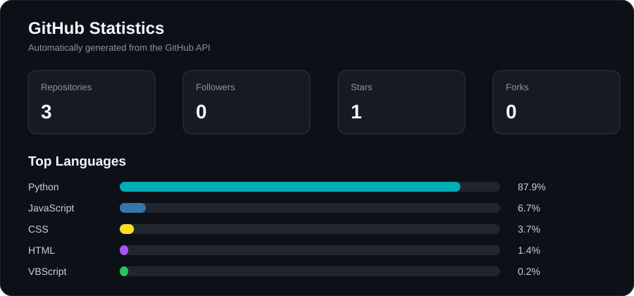

<div align="center">


# Ravi Ranjan Roy

### Computer Science Student · Local AI · Software Engineering

Building practical software around **local AI, intelligent developer tools, and system-oriented applications.**

</div>

---

## About Me

I'm a **Computer Science student and software developer** focused on the engineering side of AI — how models interact with applications, how state and behavior can be controlled, and how intelligent systems can run **locally** rather than depending on the cloud.

My approach is simple: **understand the system, make it testable, then make it useful.**

- 🧠 **Local AI & LLM applications**
- 🛠️ **AI-assisted developer tools**
- ⚙️ **Backend & API development**
- 🏗️ **System architecture & deterministic software design**
- 🔬 **Practical AI interfaces & experimentation**

---

## 🚀 Featured Projects

### 🧠 [Emi Core](https://github.com/raviranjanroy01/emi-core)
**Deterministic emotional runtime with LLM-mediated perception.**

`Python` `Ollama` `LLM` `Deterministic State`

### ⌨️ [AutoAI](https://github.com/raviranjanroy01/auto_ai)
**Local intelligent typing assistant for autocorrection and prediction.**

`Python` `NLP` `Edit Distance` `N-grams`

### 📊 [MetricFlow](https://github.com/raviranjanroy01/MetricFlow)
**Analytics platform built with React, FastAPI, PostgreSQL and SQLAlchemy.**

### 📡 Wi-Fi CSI Presence Detector
**Camera-free human presence detection using Wi-Fi channel state information.**

`ESP-IDF` `Signal Processing` `LightGBM`

---

## 🧭 Current Direction

```text
Local AI
   │
   ├── Intelligent developer tools
   ├── Real-time language assistance
   ├── Stateful AI applications
   └── Human-friendly interfaces
```

**Building AI systems that are local-first, controllable, and deeply integrated with the software around them.**

---

## 🧰 Tech Stack


---

## 📈 GitHub Stats

<div align="center">



</div>

> Stats are generated automatically from the GitHub API and refreshed daily by GitHub Actions.

---

## 🌱 What I'm Learning

- AI and LLM engineering
- Backend architecture and API design
- Systems and computer science fundamentals
- Production-oriented software engineering

---

<div align="center">

<a href="https://github.com/raviranjanroy01"></a>

### Build · Test · Iterate

</div>
